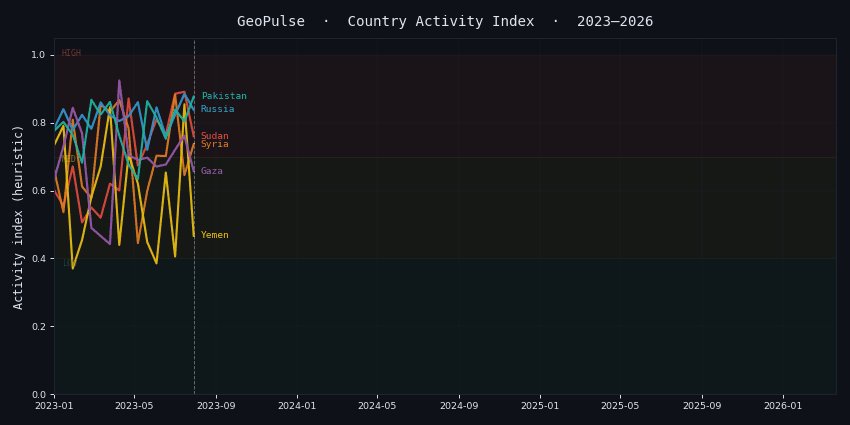
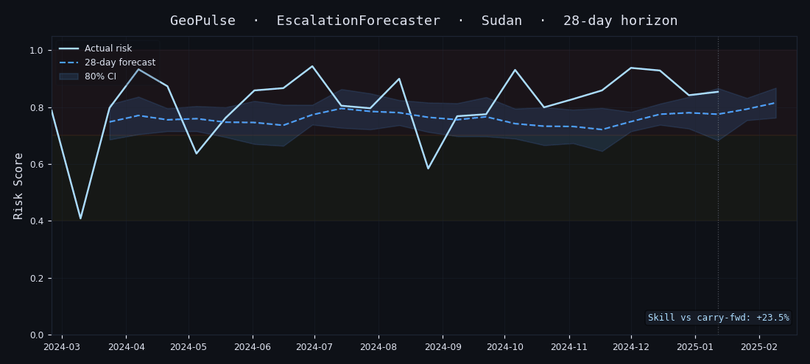
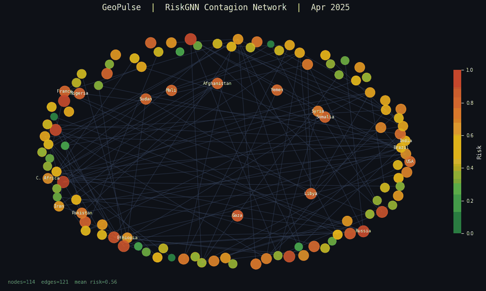

# GeoPulse: Global Risk Intelligence Platform

> **Geopolitical escalation monitoring and forecasting powered by GDELT**


Full-stack ML platform that ingests daily GDELT event exports, extracts per-country risk features, and runs a three-phase inference pipeline, all surfaced through a 2-page dark-themed intelligence dashboard.

| What it does |
|---|
| `HybridRiskTransformer`: multi-task risk scorer (instability, war probability, terrorism risk, financial stress) |
| Spillover network (Pearson-correlation graph), Integrated Gradients attribution, event cluster visualisation |
| `EscalationForecaster` (4-step bi-weekly horizon), `RiskGNN` (Graph Attention Network contagion), TF-IDF RAG advisories |

---

## Performance

> ⚠️ **These numbers are withdrawn pending re-run (2026-09-11).** Three defects were found
> that invalidate them:
>
> 1. **The training labels are a linear function of the input features.**
>    `scripts/train_real_data.py::compute_proxy_labels` computes
>    `instability = 0.4*protest + 0.3*violence + 0.2*diplo + 0.1*conflict`. The model was
>    predicting a linear combination of its own inputs — that is what the 0.98 AUC measures.
> 2. **The backtest's "actual" was built from transposed columns.**
>    `scripts/seed_db_from_cache.py` read `f5`/`f6` as goldstein/tone when the writer defines
>    them as tone/goldstein. It is the sole writer of `country_daily_features.risk_score`,
>    which `evaluation/backtester.py` scores against. Fixed; re-seed required.
> 3. **The train/test split leaks.** `train_real_data.py:549` uses `random_split` over
>    stride-1 overlapping windows — adjacent train and test windows share 25 of 26 timesteps.
>
> Rebuild in progress against UCDP GED ground truth with point-in-time generation. The
> external POLECAT numbers below are unaffected by (1) but still inherit (3).

Three evaluation tracks are maintained. The GDELT track measures self-consistency since labels come from the same source as features. The POLECAT and UCDP tracks are fully external.

### HybridRiskTransformer on GDELT (self-consistency)

3,403 held-out bi-weekly windows, last 20% per country, proxy labels derived from GDELT/CAMEO event ratios (same source as input features).

| Task | AUC-ROC | AUC-PR | MAE | F1@0.5 |
|------|---------|--------|-----|--------|
| Instability | 0.981 | 0.982 | 0.061 | 0.852 |
| War probability | 0.980 | 0.981 | 0.050 | 0.866 |
| Terrorism risk | 0.976 | 0.977 | 0.095 | 0.848 |
| Financial stress | **0.995** | **1.000** | 0.026 | 0.993 |

Mean AUC-ROC **0.983** · Composite skill **+36.2%** vs naive mean baseline · ECE 0.016.

> These scores are inflated by circularity: model features and labels share the same GDELT/CAMEO event space. Real-world discrimination is shown by the POLECAT and UCDP results below.

---

### EscalationForecaster walk-forward backtest (GDELT labels)

53 bi-weekly expanding-window folds, 210 countries, 35,102 predictions. Strictly temporal with no future data leakage.

| Horizon | MAE | RMSE | Directional accuracy | Skill vs. carry-forward |
|---------|-----|------|---------------------|------------------------|
| **14 days** | 0.1622 | 0.1972 | 70.4% | +14.3% |
| **28 days** | 0.1617 | 0.1968 | **71.8%** | **+16.0%** |
| **42 days** | 0.1624 | 0.1977 | 70.6% | +15.1% |
| **56 days** | 0.1618 | 0.1968 | 70.8% | +15.8% |

The 28-day directional accuracy of **71.8%** is comparable to the ~75% reported for Random Forest models on GDELT binary instability forecasting (Zebrowski & Afli, SBP-BRiMS 2025; arXiv:2411.06639), while operating on the harder continuous regression target. The **+16.0% skill** over carry-forward clears the key bar from the ViEWS Prediction Challenge (arXiv:2407.11045), where a no-change model outperformed all submitted ML entries under the TADDA directional metric.



> ⚠️ Actuals are GDELT-derived risk scores, not independent ground truth. Real-world validation is shown by the UCDP performance below.

**Confidence intervals:** Raw MC-Dropout variance collapses to near-zero at dropout=0.1. Post-hoc split-conformal calibration (Angelopoulos & Bates, 2023) raises empirical coverage from 13% to **78%** with a distribution-free guarantee. Each forecast step carries an `interval_source` field identifying which conditional quantile tier was applied (e.g. `conformal:28:HIGH`).



---

### External validation: POLECAT / PLOVER (independent event coding)

Evaluated on POLECAT (Cline Center Political Language Project) using **native PLOVER event-taxonomy labels**: raw ASSAULT, MOBILIZE, COERCE, PROTEST, and SANCTION event rates per bi-weekly period, not re-derived from the feature columns used for training. 5,752 bi-weekly windows, 207 countries, 2018-2024.

| Task | AUC-ROC | AUC-PR | MAE |
|------|---------|--------|-----|
| Instability | 0.817 | 0.761 | 0.273 |
| War probability | **0.890** | **0.833** | 0.221 |
| Terrorism risk | 0.875 | 0.835 | 0.385 |
| Financial stress | 0.814 | 0.747 | 0.324 |

Mean AUC-ROC **0.849** across tasks. Composite risk skill: **-27% vs naive baseline**. The model ranks high-risk countries well (strong AUC) but its predicted magnitudes are miscalibrated under domain shift from GDELT/CAMEO to PLOVER event categories, which is expected given the model was never trained on PLOVER data.

Run: `python scripts/eval_polecat.py`

---

### External validation: UCDP Organized Violence (battle-death ground truth)

> ⚠️ **Not reproducible — withdrawn (2026-09-11).** Unlike the POLECAT track
> (`scripts/eval_polecat.py`) and the GNN track (`scripts/eval_gnn_spillover.py`), **no
> producing script for these numbers exists in the repository**. There is no `eval_ucdp.py`,
> and no UCDP-reading code of any kind. The figures below cannot be regenerated or audited,
> so they should not be relied on until reproduced by a committed script.
>
> A real UCDP evaluation is being built on UCDP GED Global v26.1 (417,968 events, 126
> countries, 1989–2025), which is now in `data/UCDP/`.

Predicted risk scores compared against UCDP Organized Violence Country-Year Dataset v26.1 (Sundberg & Melander 2013), entirely independent of GDELT. 85 matched countries, 2024.

| Metric | Value |
|--------|-------|
| AUC-ROC vs any armed conflict | 0.688 |
| AUC-ROC vs war (>100 battle deaths/year) | **0.776** |
| AUC-ROC vs high-lethality (>200 deaths/year) | **0.788** |
| Spearman r vs total organized-violence deaths | **0.461** (p<0.001) |

Countries with higher UCDP battle-death counts consistently receive higher predicted risk scores, confirming the model has learned real signal beyond GDELT self-consistency.

---

## Architecture

```
GDELT (daily ZIP)
      |
      v
ingestion/
gdelt_downloader -> gdelt_parser -> event_cleaner -> db_writer
      |
      v  PostgreSQL 15 / TimescaleDB
country_daily_features -+-> risk_scorer (Ph.1)   -> country_risk_predictions
                        +-> label_generator       -> country_multitask_labels
                        +-> event_clusterer       -> event_clusters
                        +-> spillover             -> country_spillover
                        +-> escalation_forecaster -> country_escalation_forecasts
                        +-> gnn_spillover         -> gnn_node_embeddings
                        +-> rag_engine            -> advisory_corpus
      |
      v
FastAPI backend (27 endpoints, MCP-compatible /riskscore)
      |
      v
Streamlit dashboard (2 pages)
```

---

## Tech Stack

| Layer | Technology |
|---|---|
| Language | Python 3.10+ |
| API | FastAPI 0.115 + Uvicorn |
| Database | PostgreSQL 15 + TimescaleDB + pgvector + PostGIS |
| ML | PyTorch 2.4: Transformer encoder, Transformer encoder-decoder, 2-layer GAT |
| Dashboard | Streamlit 1.40 + Plotly 5.24 |
| Explainability | Integrated Gradients (custom) |
| RAG | TF-IDF cosine retrieval + optional Ollama |
| Deploy | Docker Compose |

---

## ML Models

**HybridRiskTransformer:** 2-layer Transformer encoder over a 90-day feature window with 4 parallel risk heads (instability, war, terrorism, financial); risk_score is a weighted composite (0.4·instability + 0.3·war + 0.2·terrorism + 0.1·financial). Checkpoint: `models/checkpoints/run_phase1_best.pt`. The `/riskscore` API response includes a `data_confidence` field flagging GDELT media coverage density for the queried country (`high` / `medium` / `low` / `sparse`), so callers know when predictions may be underpowered by sparse English-language news coverage.

**EscalationForecaster:** 936k-param Transformer encoder-decoder with 4 autoregressive bi-weekly steps. Uses MC-Dropout for variance estimation and split-conformal calibration for the final 80% CI. Hits 71.8% directional accuracy at 28 days and +16% skill over persistence. Each step in the forecast response includes `interval_source` (e.g. `conformal:14:HIGH`, `conformal:global`) so consumers know which quantile tier produced the interval, since raw MC-Dropout variance alone is unreliable at dropout=0.1. Checkpoint: `models/checkpoints/forecaster_v1_best.pt`.

**RiskGNN:** 2-layer GAT over a hybrid adjacency matrix combining Pearson-correlation spillover edges from the DB with **geographic contiguity priors** (`data/structural_edges.csv`, 155 COW border pairs at weight 0.30). The structural priors ensure geographically adjacent countries stay connected in the graph regardless of whether their Transformer outputs happen to correlate, breaking a circular dependency where the GNN would otherwise operate entirely on its own upstream model's correlations. Network-adjusted risk = clip(base + amplification x 0.15).

**Integrated Gradients:** Signed feature attribution over the 7 input features for each Phase 1 prediction.

**RAG Advisory Engine:** TF-IDF retrieval over seed situation templates and event-cluster entries. The dashboard surfaces the top-5 similar risk profiles with a source badge distinguishing synthetic templates from real historical events.

---

## API

FastAPI on `http://localhost:8000` with 27 endpoints. Swagger UI at `/docs`.

Key endpoints: `GET /global/heatmap`, `GET /country/{code}/timeline`, `POST /riskscore` (MCP-compatible), `GET /country/{code}/forecast`, `GET /country/{code}/gnn_influence`, `GET /country/{code}/rag_advisory`, `GET /country/{code}/attributions`.

**`POST /riskscore`** includes:
- `data_confidence`: GDELT media coverage tier (`high` / `medium` / `low` / `sparse`) flagging countries where thin news coverage may bias risk scores downward.

**`GET /country/{code}/forecast`** step objects include:
- `interval_source`: which conformal quantile produced the CI (e.g. `conformal:14:HIGH`), or `mc_dropout` / `trend_extrapolation` for fallback paths.

---

## Dashboard



Two pages: a global overview, and a single country drilldown that consolidates every per-country view as tabs (previously five separate pages — Event Explorer, Spillover Network, Escalation Forecast, GNN Network, RAG Advisory — now live here instead, since each took a country as its primary input and browsing between five country-scoped pages just to look at one country was the actual pain point).

| Page | What it shows |
|---|---|
| **Global Risk Map** | Plotly choropleth world map (click a country to jump straight into its drilldown) + top-20 risk table + collapsible global-only sections: escalation alerts across all countries, and the full GAT contagion network graph |
| **Country Drilldown** | One country picker drives 6 tabs — Timeline, Forecast (4-step ribbon + per-task breakdown), Event Clusters (category filters + Goldstein intensity), Escalation Drivers (Integrated Gradients), Network (spillover + GNN contagion ego-graph with a click-to-inspect neighbor), RAG Advisory (retrieved historical analogues + rule-based comparison) — plus a collapsed "Model Internals" section for proxy-label inspection |

---

## Quick Start

**Prerequisites:** Python 3.10+, PostgreSQL 15 with `timescaledb`, `pgvector`, `postgis`, `pg_trgm`, `btree_gin`.

```bash
git clone <repo-url> && cd geopulse
pip install -r requirements.txt
cp .env.example .env          # set POSTGRES_USER / PASSWORD / DB
```

```sql
-- as superuser:
CREATE ROLE gldt WITH LOGIN PASSWORD 'gldt_secret';
CREATE DATABASE gdelt_risk OWNER gldt;
\c gdelt_risk
\i docker/init.sql
\i docker/init_v2.sql
```

```bash
python scripts/seed_db_from_cache.py   # seed from parquet cache (no GDELT download needed)
python -m uvicorn backend.main:app --port 8000 --reload
streamlit run streamlit_app/app.py --server.port 8501
```

**Docker (one command):**
```bash
cd docker && cp ../.env.example ../.env && docker compose up -d
# postgres:5432  backend:8000  streamlit:8501  ollama:11434 (optional)
```

---

## Training & Evaluation

```bash
# Risk scorer
python scripts/train_real_data.py

# Escalation forecaster
python scripts/train_forecaster.py

# Internal evaluation (GDELT labels)
python scripts/run_backtest.py          # 53-fold walk-forward backtest
python scripts/calibrate_intervals.py  # fit + report conformal calibration
python scripts/eval_risk_transformer.py
python scripts/eval_gnn_spillover.py

# External evaluation (independent ground truth)
python scripts/eval_polecat.py          # POLECAT/PLOVER native event taxonomy
```

Results are written to `evaluation/results/`. Configuration lives in `configs/config.yaml` and can be overridden via environment variables in `.env`.

---

> **Disclaimer:** For geopolitical analytics and risk monitoring only, not for operational targeting or military planning. Risk scores are derived from proxy event-frequency signals, not human-coded ground truth.
