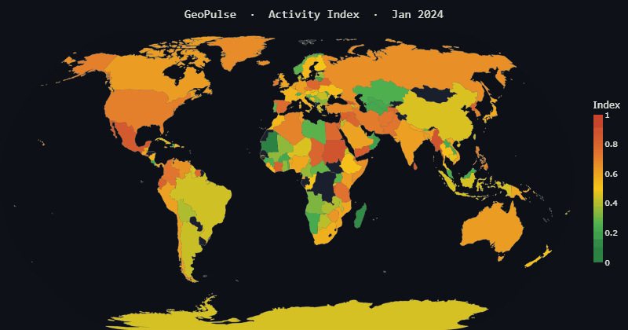
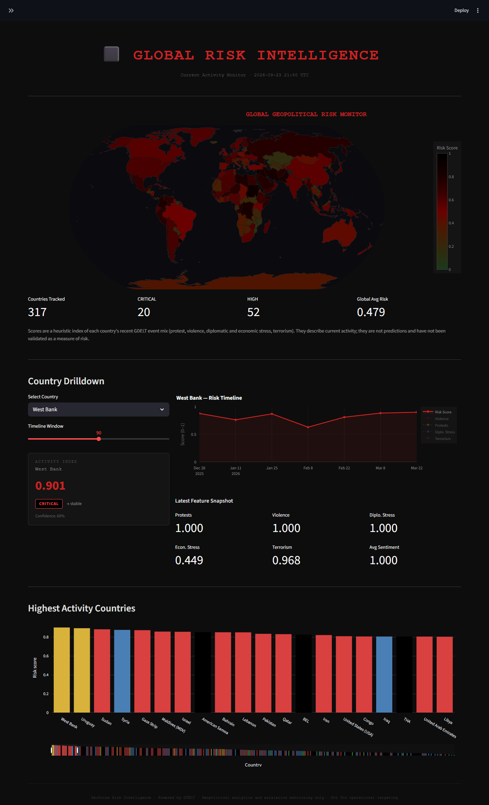
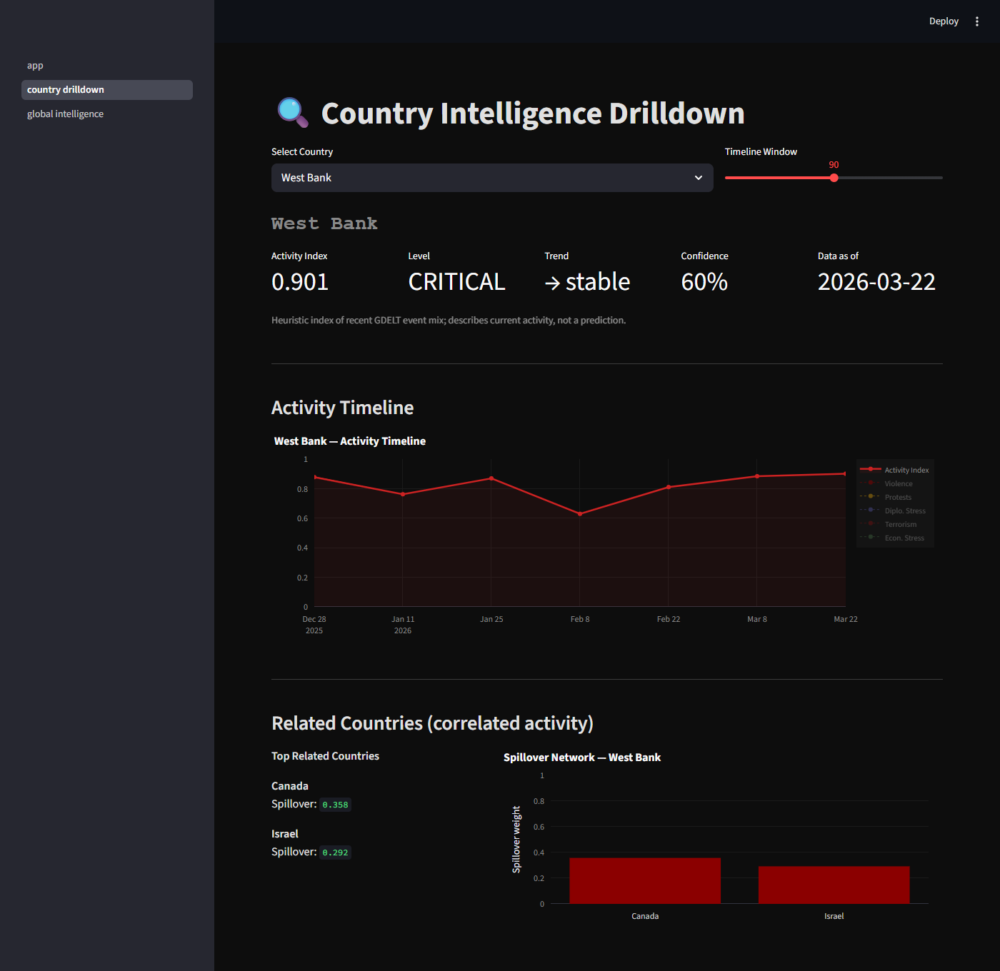
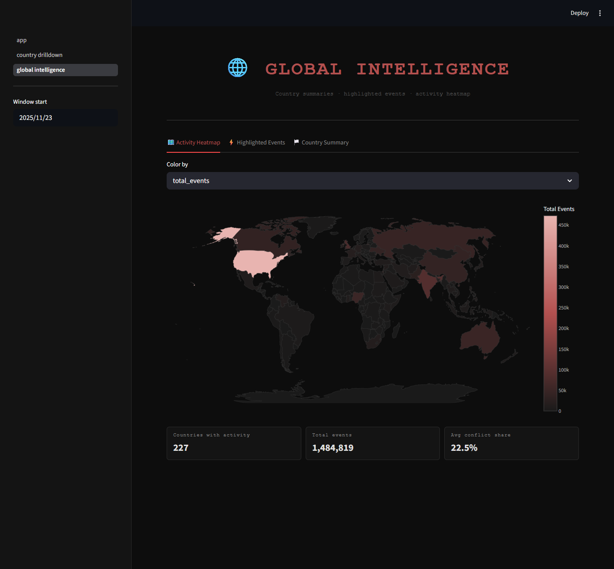
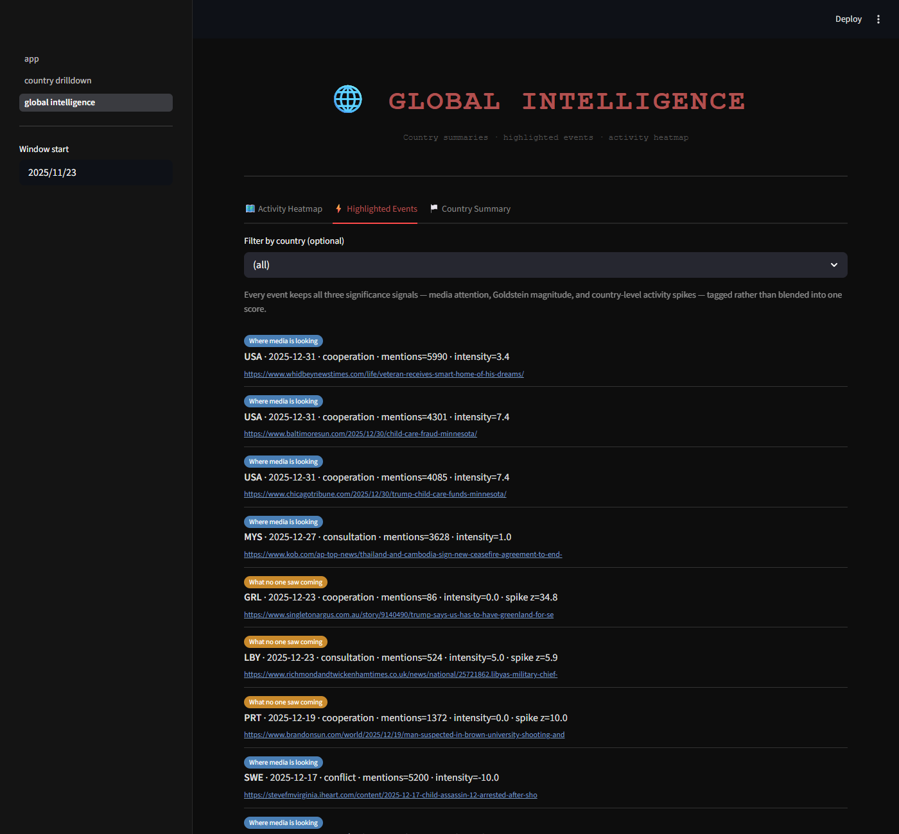
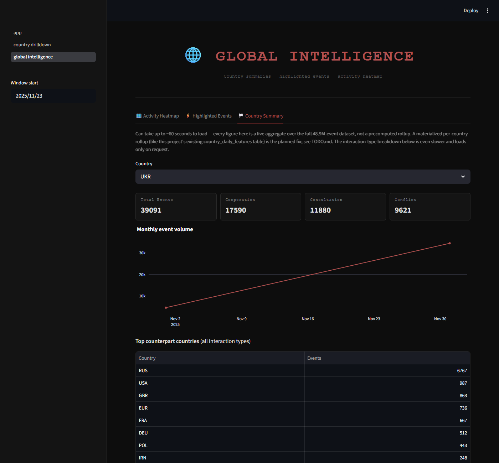

# GeoPulse: Global Activity Monitor

> **A country-level view of what GDELT is reporting: an activity map, highlighted events, and per-country summaries.**



GeoPulse ingests GDELT event data into PostgreSQL, derives per-country features, and serves them through a FastAPI backend to a Streamlit dashboard. It describes recent activity. It does not forecast, and nothing here has been validated as a measure of risk.

---

## What it does

**Activity index (Home, Country Drilldown).** Each country gets a single 0-1 index built from the mix of events GDELT recorded for it (protest, violence, diplomatic and economic stress, terrorism). It is a hand-weighted heuristic, not fitted to outcomes. The `confidence` value reflects data coverage only.

**Global Intelligence.** Built directly on the ~49M-event `graph.*` tables:

| Tab | What it shows |
|---|---|
| Activity Heatmap | Choropleth by total events, conflict share, average intensity, or mentions, for a chosen window |
| Highlighted Events | Top events, each tagged with every signal it earns: **Where media is looking** (mention volume), **Where people are looking** (Goldstein magnitude), **What no one saw coming** (country-day activity spike vs. a trailing 30-day baseline) |
| Country Summary | Event volume trend, cooperation / consultation / conflict mix, and top counterpart countries |











The Home bar chart is colored by trend: red increasing, blue decreasing, yellow stable above 0.5, green stable below 0.5, black unknown.

---

## Known limitations

- **The activity index is a heuristic.** Weights are hand-picked and unvalidated. See [`scoring/composite.py`](scoring/composite.py), the single implementation of the formula; weights come from `configs/config.yaml`.
- **Sparse coverage.** GDELT coverage is uneven, so countries with little coverage score less reliably.
- **`avg_sentiment` and `avg_goldstein` are inconsistent** across the pipelines that write them (seed script, live ingestion, POLECAT), so those two signals are left out of the live scoring paths.
- **Data window.** The seeded activity index ends in March 2026 and the `graph.*` event data in February 2026.
- **Country Summary is slow** (about 20-60 seconds): every figure is a live aggregate over the full event table. A materialized per-country rollup would fix this.
- **Counterparts are sparse.** GDELT rarely gives an explicit country for the other side of an interaction, so by-type counterpart breakdowns are often empty.
- **Duplicate country codes.** A few countries appear under both a FIPS and an ISO-3 code with different scores. The dashboard disambiguates them but the data is not merged.

Not part of the dashboard and treated as experiments: the forecasting, GNN, and RAG-advisory code (`streamlit_app/_parked/`, `models/`, `inference/`), and a point-in-time conflict-prediction pipeline (`preprocessing/pit_*.py`, `evaluation/pit_backtest.py`) that was paused. `TODO.md` records the history and open items.

---

## Architecture

```
GDELT event exports
      |
      v
ingestion/  ->  PostgreSQL
                  country_daily_features -> latest_country_risk (activity index)
                  graph.event / actor / location / country      (event graph)
                        |                   \
                        |                    +-> Neo4j (optional; ingestion/neo4j_migrator.py)
                        v
FastAPI backend   /global/*, /country/*, /intelligence/*
      |
      v
Streamlit dashboard   (Home, Country Drilldown, Global Intelligence)
```

Neo4j is optional and only used for graph analysis work. The graph schema is documented in [`docs/neo4j_schema.md`](docs/neo4j_schema.md), and the target use case in [`usecase.md`](usecase.md).

**Stack:** Python 3.10+, FastAPI + Uvicorn, PostgreSQL, Streamlit + Plotly, Neo4j (optional).

---

## Quick start

**Prerequisites:** Python 3.10+, PostgreSQL with the schema from `docker/init.sql` (plus `scripts/init_graph_schema.sql` for the Global Intelligence tables).

```bash
pip install -r requirements.txt
cp .env.example .env          # set POSTGRES_USER / PASSWORD / DB
python scripts/seed_db_from_cache.py   # seed the activity index from data/real_cache
python -m uvicorn backend.main:app --port 8000
streamlit run streamlit_app/app.py --server.port 8502
```

On Windows, `run_app.ps1` starts both. The Global Intelligence tabs need the `graph.*` tables populated (`ingestion/graph_builder.py`).

## Tests

```bash
python -m pytest tests/ -q
```

Database-backed tests skip themselves when Postgres or Neo4j is unreachable. `tests/test_country_summary.py` runs aggregates over the full event table and is slow.

---

> **Disclaimer:** For exploratory analytics only. The activity index is a heuristic derived from proxy event-frequency signals, not human-coded ground truth, and should not be used for operational, safety, or targeting decisions.
