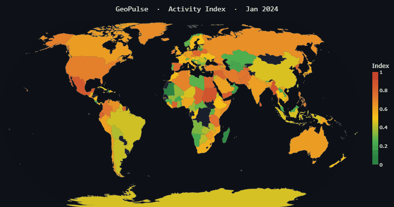
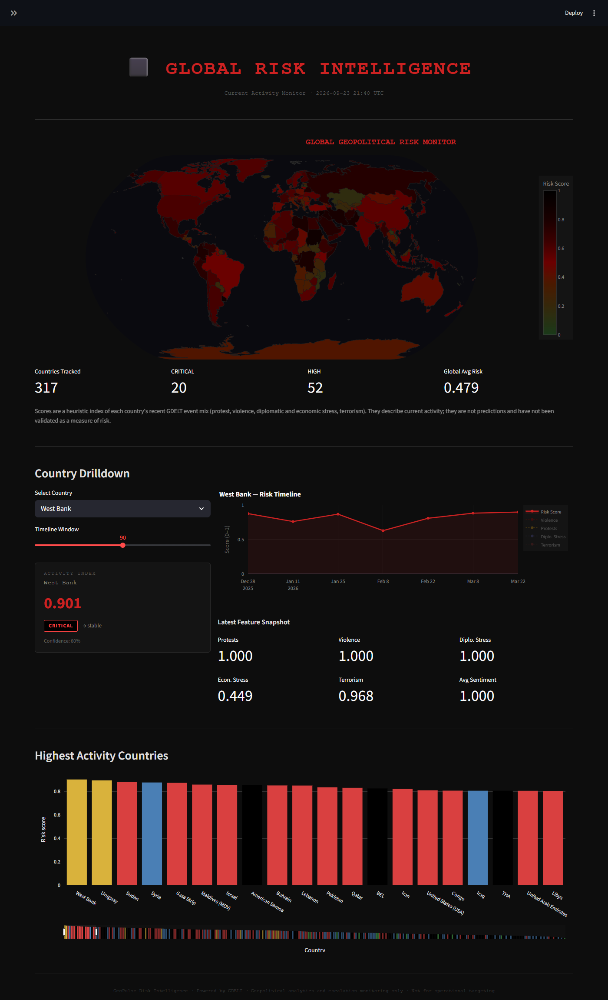
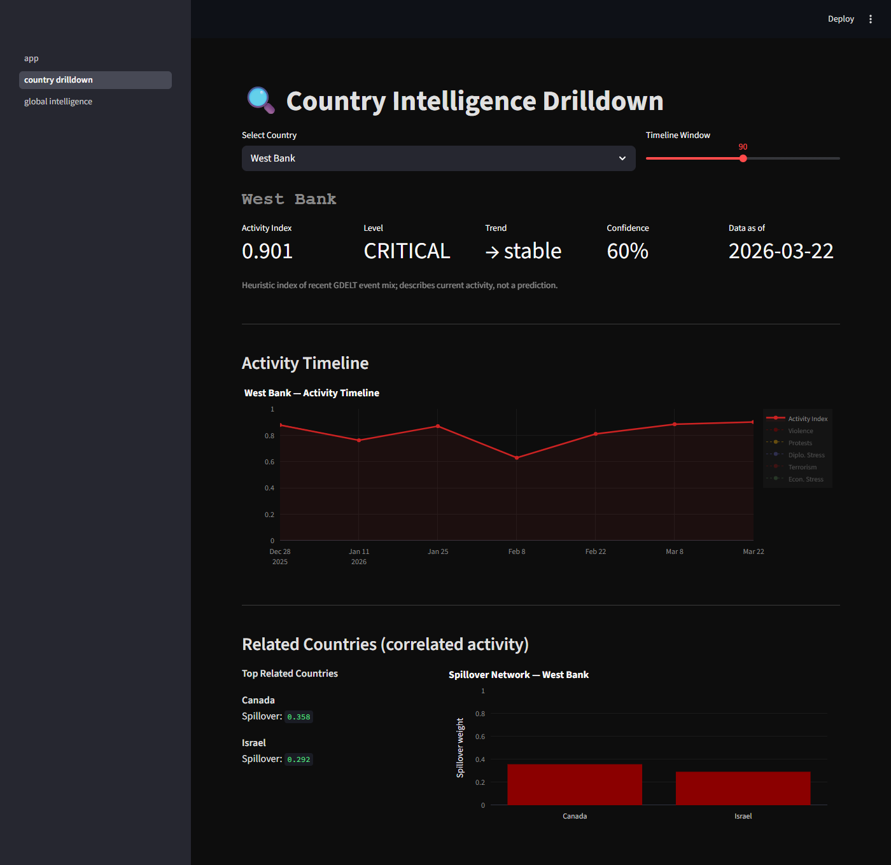
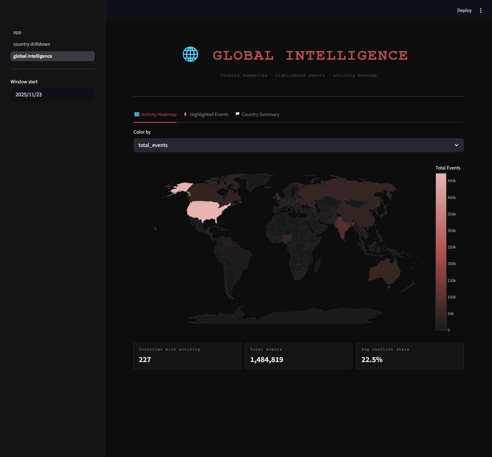
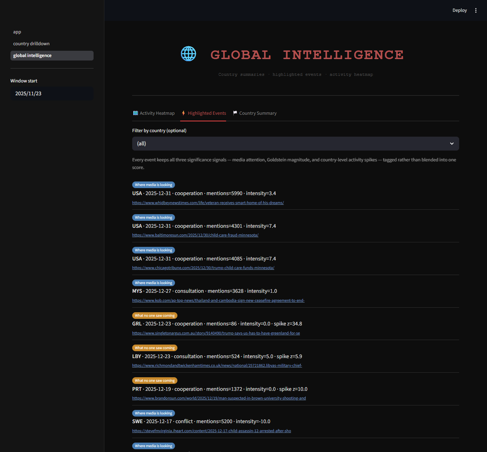
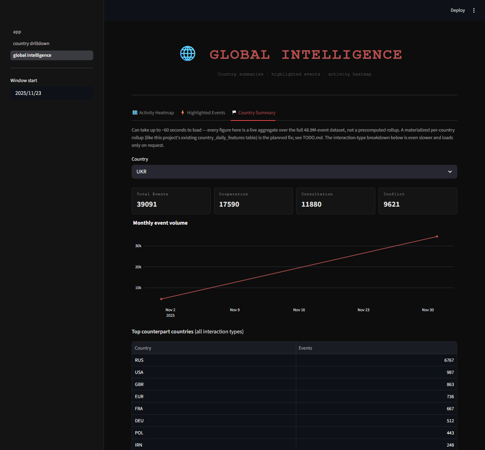

# GeoPulse: Global Activity Monitor

> A country-level view of what GDELT is reporting: an activity map, highlighted events, and per-country summaries.



GeoPulse ingests GDELT event data into PostgreSQL, derives per-country features, and serves them through a FastAPI backend to a Streamlit dashboard. It describes recent activity. It does not forecast, and nothing here has been validated as a measure of risk.

## What it does

**Home and Country Drilldown** show a per-country activity index: a single 0-1 value built from the mix of events GDELT recorded for the country (protest, violence, diplomatic and economic stress, terrorism). It is a hand-weighted heuristic, not fitted to outcomes, and its `confidence` value reflects data coverage only. The Home bar chart is colored by trend: red increasing, blue decreasing, yellow stable above 0.5, green stable below 0.5, black unknown.

**Global Intelligence** is built directly on the ~49M-event `graph.*` tables:

| Tab | What it shows |
|---|---|
| Activity Heatmap | Choropleth by total events, conflict share, average intensity, or mentions, for a chosen window |
| Highlighted Events | Top events, each tagged with every signal it earns: **Where media is looking** (mention volume), **Where people are looking** (Goldstein magnitude), **What no one saw coming** (country-day activity spike vs. a trailing 30-day baseline) |
| Country Summary | Event volume trend, cooperation / consultation / conflict mix, and top counterpart countries |











## Architecture

```
GDELT event exports
      |
      v
ingestion/  ->  PostgreSQL
                  country_daily_features -> latest_country_risk   (activity index)
                  graph.event / actor / location / country        (event graph)
                        |                    \
                        |                     +-> Neo4j (optional copy, ingestion/neo4j_migrator.py)
                        v
FastAPI backend   /global/*, /country/*, /intelligence/*
      |
      v
Streamlit dashboard   (Home, Country Drilldown, Global Intelligence)
```

**Stack:** Python 3.10+, FastAPI + Uvicorn, PostgreSQL, Streamlit + Plotly, Neo4j (optional).

The activity-index formula lives in one place, [`scoring/composite.py`](scoring/composite.py), with weights from `configs/config.yaml`. Neo4j holds a verified copy of the event graph but nothing in the dashboard reads from it; the graph schema is documented in [`docs/neo4j_schema.md`](docs/neo4j_schema.md).

## Quick start

**Prerequisites:** Python 3.10+ and PostgreSQL (with TimescaleDB for `docker/init.sql`). Neo4j is only needed for the optional graph copy.

```bash
pip install -r requirements.txt
cp .env.example .env          # set POSTGRES_USER / PASSWORD / DB
```

Create the database and schema as a Postgres superuser:

```sql
CREATE ROLE gldt WITH LOGIN PASSWORD 'gldt_secret';
CREATE DATABASE gdelt_risk OWNER gldt;
\c gdelt_risk
\i docker/init.sql
\i docker/init_v2.sql                     -- related countries and event clusters
\i docker/migrations/001_add_coverage_tier.sql
\i scripts/init_graph_schema.sql          -- graph.* tables used by Global Intelligence
```

Build the feature cache, seed the database, and run:

```bash
python scripts/build_feature_cache.py   # downloads GDELT daily files into data/real_cache (not in the repo)
python scripts/seed_db_from_cache.py    # activity index, from that cache
python -m uvicorn backend.main:app --port 8000
streamlit run streamlit_app/app.py --server.port 8501
```

Later cache builds can pass `--cache-only`. On Windows, `run_app.ps1` starts the backend (8000) and dashboard (8501) together.

- **Home and Country Drilldown** work after the seed step.
- **Global Intelligence** also needs the `graph.*` tables populated from GDELT events (`ingestion/graph_builder.py`); without them its tabs are empty.
- **Neo4j (optional):** run `python scripts/init_neo4j_schema.py`, then `ingestion/neo4j_migrator.py`. Connection settings are in `.env`.

## Tests

```bash
python -m pytest tests/ -q
```

Database-backed tests skip themselves when Postgres or Neo4j is unreachable. `tests/test_country_summary.py` aggregates over the full event table and is slow.

## Known limitations

- **The activity index is a heuristic.** Weights are hand-picked and unvalidated.
- **Sparse coverage.** GDELT coverage is uneven, so countries with little coverage score less reliably.
- **`avg_sentiment` and `avg_goldstein` are inconsistent** across the pipelines that write them (seed script, live ingestion, POLECAT), so they are left out of every scoring path that reads them back from the database. Only the parquet-seeding script, which sees the original values, uses them.
- **No network analysis.** The event graph is loaded into Neo4j, but no graph analysis (communities, influence over time) exists, and the Graph Data Science plugin is not installed.
- **Data window.** The seeded activity index ends in March 2026 and the `graph.*` event data in February 2026.
- **Country Summary is slow** (about 20-60 seconds), because every figure is a live aggregate over the full event table.
- **Counterparts are sparse.** GDELT rarely gives an explicit country for the other side of an interaction, so by-type counterpart breakdowns are often empty.
- **Duplicate country codes.** A few countries appear under both a FIPS and an ISO-3 code with different scores. The dashboard disambiguates them but the data is not merged.

Earlier forecasting, GNN, RAG-advisory, and conflict-prediction experiments were removed from the tree (commit "remove the parked ML stack") and remain in git history.

---

> **Disclaimer:** For exploratory analytics only. The activity index is a heuristic derived from proxy event-frequency signals, not human-coded ground truth, and should not be used for operational, safety, or targeting decisions.
